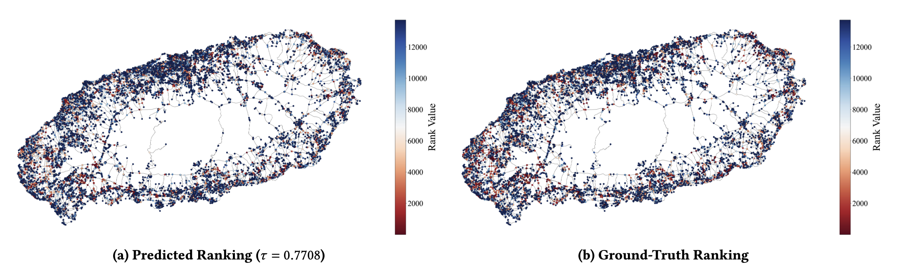

# BRAVA-GNN: Betweenness Ranking Approximation Via Degree MAss Inspired Graph Neural Network
<a href="https://arxiv.org/abs/2602.09716"></a>

Official code implementation for BRAVA-GNN, a parameter-efficient GNN for approximating betweenness centrality with to 214% improvement in Kendall–Tau correlation and up to 66× speedup in inference time over current state-of-the-art GNN-based approaches.

---

## Visual Results

Visual comparison on the Jeju Island road network. The predicted rankings (a) closely align with the ground-truth topology (b), demonstrating the model's capability to capture structural importance in high-diameter graphs.

## Setup

To install dependencies and activate the virtual environment (using `uv`):
```bash
source setup.sh
```

## Dataset Details

All datasets are sourced from [SNAP](https://snap.stanford.edu/data/) or [Network Repository](https://networkrepository.com/).

To download and process the main datasets automatically:
```bash
bash datasets/download_datasets.sh
```
Then, import/convert datasets for [ABCDE](https://github.com/MartinXPN/abcde/tree/main):
```bash
wget https://github.com/MartinXPN/abcde/releases/download/v1.0.0/real.zip
unzip real.zip && rm real.zip
mv real/* datasets/real_graph/
rmdir real

python baselines/convert_abcde.py
```

---

## Running the model code

```bash
# Final model hyperparameters
python betweenness.py --init_type degree_mix_mass_6 --num_layers 2 --nhid 12 --dropout 0.3 --train_type SF_10_HY_10_2 --seed 1 --run_all_tests
```
*   `--run_all_tests` will test on entire test suite, instead of a small subset.
*   `--train_type` trains on a mix of 10 Scale-Free and 10 Hyperbolic graphs.

---

### ABCDE Baseline

To import/convert datasets for [ABCDE](https://github.com/MartinXPN/abcde/tree/main) format:
```bash
wget https://github.com/MartinXPN/abcde/releases/download/v1.0.0/real.zip
# Or using curl for macos:
# curl -L -O https://github.com/MartinXPN/abcde/releases/download/v1.0.0/best.ckpt
unzip real.zip && rm real.zip
python baselines/convert_abcde.py
```

To download ABCDE model:
```bash
mkdir models && cd models
wget https://github.com/MartinXPN/abcde/releases/download/v1.0.0/best.ckpt
```

To run the ABCDE experiment:
```bash
python baselines/run_abcde.py --seed 1
```

---

## GNN-Bet Baseline

```bash
python GNN-Bet/betweenness.py --g SF
```

---

## Results

Results are automatically appended to CSV files in the `results/` directory:
*   `results/all_results.csv`: Kendall Tau correlation scores.
*   `results/all_results_topk.csv`: Detailed Top-K accuracy metrics.
*   `results/all_results_wallclock.csv`: Inference time measurements.

The following command will generate all LaTeX tables used in the paper from the results folder. To generate a specific table, use `--table main` for the main results and `--table 1–6` for the ablation studies.

```bash
python parse_results.py
```

---

## Citation

If you find BRAVA-GNN useful in your research, please cite our paper:

```bibtex
@misc{dachille2026bravagnn,
      title={BRAVA-GNN: Betweenness Ranking Approximation Via Degree MAss Inspired Graph Neural Network}, 
      author={Justin Dachille and Aurora Rossi and Sunil Kumar Maurya and Frederik Mallmann-Trenn and Xin Liu and Frédéric Giroire and Tsuyoshi Murata and Emanuele Natale},
      year={2026},
      eprint={2602.09716},
      archivePrefix={arXiv},
      primaryClass={cs.LG},
      url={https://arxiv.org/abs/2602.09716}, 
}
```
